# Threat Model Demo Part 1 - Using threagile for threat modeling


This repo is used to demonstrate using Threagile (better-threagile) as a threat model tool.  The purpose of this repo is to

* Demonstrate how the threat model should live as a versioned artifact next to your code. We'll use branches to show threat model evolution.
* Demonstrate an iterative process of developing a threat model from a concept app to an app that has incorporated recommendations from the threat model output
* Learn about artifacts such as DFDs, reports, and spreadsheets generated with each update. 
* Demonstrate how to incorporate GitHub Actions to automate updates to the report with pushes to the repo.
* Demonstrate how to perform other GitHub actions relevant to secure CI/CD development with SAST/DAST patterns
* Demonstrate how to create custom risk rules to analyze custom or emerging risks
* Demonstrate how to use optional fields such as Security Requirements and Abuse Cases to drive conversations

# Where to start?

This branch is your starting point. It provides a sample threat model starter based on a very simple application. Because an action hasn't yet been configured to generate threat model reports, you can either refer to the threat model artifacts in the /report folder, or follow these steps to generate your own. For stability, I recommend forking or cloning the Threagile Repo so you have a consistent copy to work from.  

## Prerequisites

You don't really have to install anything to use this tutorial.  If working with code and generating threat models helps you learn better, you are certainly welcome to install the necessary apps noted below.

This repo targets VSCode and contains settings related to schema validation and auto-completion.  If you're not using VSCode, refer to the better-threagile repo for instructions for other IDEs.

## Known bugs and issues

The threagile playground on the official website isn't kept up-to-date and threat models generated using newer versions may fail in that playground.  As a best practice, you wouldn't want to upload your threat models to a third-party site anyway.

The excel report tab is given the same name as your threat model title.  If this exceeds 31 characters then threagile report generation will fail. I recommend a shorter title because the excel reports can be valuable.  If you insist on a long title, you can add the following flags to your report generation to skip the excel output.

    --skip-tags-excel --skip-risks-excel
However, keep in mind that the title may still overrun the edge of the PDF report page.  

It appears a lot of effort went into this tool but development has slowed significantly since release. For that reason, a fork of the official repo is being demonstrated and this demo will touch on a few features such as infrastructure auto-discovery as well as risk methodologies not included in the official repo.

With these new features also come new issues.  Methodologies such as VAST require some specific wiring in the yaml to apply the rules properly.  Because of that, earlier branches of this tutorial may not work with all methodologies.  Once I've validated more model examples, I'll include those samples as well.

Risk rules summary at the end of the document isn't populating.

# The Concept Application

This threat model is based on the concept of a very simple Hello World API endpoint that accepts json data and returns a hello world type response payload. 

Draft requirements might be:
* exposed to the "public" over HTTP
* require no authentication
* do no input validation
* take the json object with a name and returns json hello response object
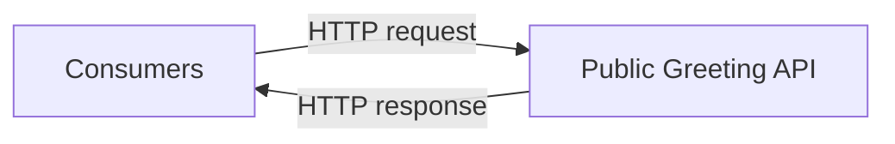

Architecturally, it might look this diagram.

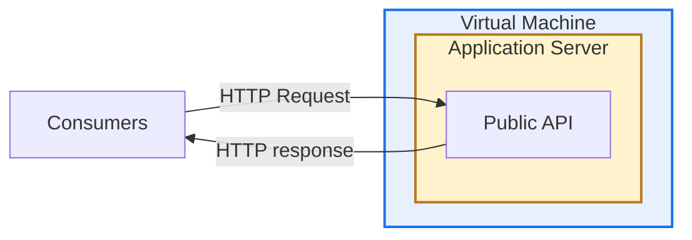
With the payloads
```
POST Request
{"name": "Alice"}

Response
{"response": "Hello Alice!"}
```

# Steps to produce the report

1. Clone this repository
1. Review the documentation at [Better-Threagile](https://github.com/Luv1881/better-threagile) to determine if and how you want to generate threat models locally.  The easiest and safest method is with docker 
1. If using docker, generate the default STRIDE threat model report from the base of the repo.  Running this will overwrite the existing report
    
    ```docker run --rm -it -v "$(pwd)":/app/work threagile:latest analyze-model --verbose --model /app/work/sample-model.yaml --output /app/work/report/```
1.  Review the report outputs, understand the elements associated with the reports, and how they're generated.

Before we examine the report artifacts, lets look at how the YAML is composed and what the minimum necessary blocks are for the default STRIDE methodology.  This will be helpful for understanding the report content.

# Threat Model Schema

## Business Information
Every report starts with the threagile version as well as relevant business information. This block is pretty self-explanatory and covers a number of business related items such as the app/report name, report author, management summary, etc.

    ```
    threagile_version: 1.0.0
    title: Greeting Application

    date: 2026-01-01

    author:
    name: Alice Example

    management_summary_comment: >
    Just a sample app to demonstrate threat modeling of an API Endpoint

    business_criticality: critical

    business_overview:
    description: Just an API endpoint for Hello World.  Nothing could go wrong at all, could it?

    technical_overview:
    description: > 
        This API endpoint listens on port 8081 at the route /helloWorld,
        accepts a json payload with a name, and returns a greeting.
        It is implemented in Python using the built-in HTTPServer class.

    security_requirements:
    PHI/PII: Usage of PHI/PII is not allowed in this application.  The application should not be used to process any sensitive data.```

When using the schema validation, you can hover over most fields to see a list of valid options, such as for business criticality.

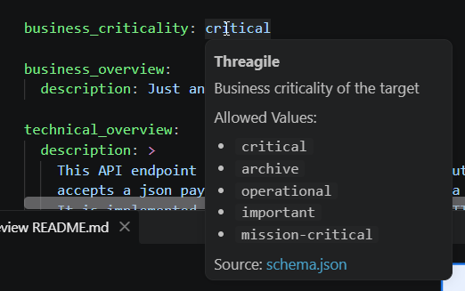

These enumerable hints are often used by the rules to properly calculate risks.

Other free form fields are up to the business to determine what needs to be there.  Fields such as technical description and security requirements may help anyone reading the report understand the assumptions about the threat model, the nature of the application, or the authors assumptions about architecture or security controls.  Too much information may make the report hard to read.  Too little information may not paint the whole picture.

## Tags

The next section deals with tag definitions

    tags_available:
        - python
        - httpserver
        - apiendpoint
        - jsonpayload
        - basicauth
        - webserver
        - linux
        - ubuntu
        - internal
        - edge
        - remoteaccess
        - ssh


This section is used to define tags that may appear later in the threat model.  If they are not defined in this section an error may be generated when you attempt to generate the threat model.

Tags are used to
- give more specific context to an asset than a technology type provides.
- optionally trigger custom rules based on one or more tags

For instance, technology assets only have three types - process, data-store, and external-entity.  You might want to use tags to call out specific frameworks, languages, or other descriptors that you could use in a custom rule.

## Core elements
The next several sections are the core of the threat model. Each asset type - data, technical, trust boundaries, and shared runtimes define the shape of your application and directly affect the generated output. Each of these asset blocks begins with the asset type and if hinting is working correctly, you can generate an asset stub.

    data_assets:
    technical_assets:
    trust_boundaries:
    shared_runtimes:


### Data assets
Data assets define just that - data that is either in transit or at rest.  This asset type is one of the smaller elements and easy to comprehend.  

    data_assets:

        JSON Payload:
            id: json-request-response
            description: Payload for the request/response exchange
            type: data 
            usage: business
            tags: 
            - jsonpayload
            origin: Untrusted Clients
            owner: Alice's Development Team
            quantity: very-few
            confidentiality: public
            integrity: critical 
            availability: operational
            justification_cia_rating: >
              We're just doing hello world, so no need for any special CIA ratings here. Right?

Again, each of the fields that requires specific values should either hint or have a tool-tip depending on how your IDE is setup.  If unsure, refer to the schema, code snippets file, other examples, or the built-in stub model that can be generated.  They're mostly self-explanatory and shouldn't require much assistance to complete. Multiple data assets can and should be included under each ```data_assets:``` block. 

One important thing to note about each of the CIA elements.  You should assume a threat mindset when deciding how to rate each element.  Each data asset is going to require its own rating and these directly affect how risk are calculated in the reports.  A web page data asset (html) built as a static object being served to the public may truly only rate public for confidentiality. However, a page intended to be internal that may display something like a corporate directory should be given a more strict value.  What if there's a regulation that certain data elements are present on your public web page, such as how to make a FOIA request?  Even though that might still be static and public, the availability and integrity of that data is now much more critical. By classifying based on what damage, cost, or reputation impact a threat could impose, you'll find your reports surfacing more valuable information for you to consider.

### Technical Assets
Data assets don't just reside in the ether even if they travel across it! Technical assets are where you'll define where data is stored, processed, and transited.  They can be servers, network devices, processes, web browsers, etc.  While there are only three technology types, there are a number of 'technologies' you can choose from, so don't fret too much about the type and focus more on the technology element.

    Python HTTP Service:
        id: python-http-service
        description: The python HTTP server that implements the /helloWorld endpoint
        type: process
        usage: business
        used_as_client_by_human: false
        out_of_scope: false
        justification_out_of_scope:
        size: application
        technology: web-service-rest
        tags:
            - httpserver
            - python
            - apiendpoint
        internet: true
        machine: virtual
        encryption: none
        owner: Alice's Development Team
        confidentiality: strictly-confidential
        integrity: critical
        availability: operational
        justification_cia_rating: >
            We said it's just a hello world API, so no need for any special CIA ratings here.
            At the same time, the service runs on our server and nobody should be able to access the server without authorization
        multi_tenant: false
        redundant: false
        custom_developed_parts: true
        data_assets_processed:
            - json-request-response
        data_assets_stored:
        data_formats_accepted:
            - json
            - serialization
        communication_links:
            Public Greeting API Response:
                target: public-clients
                description: HTTP response from /helloWorld
                protocol: http
                authentication: none
                authorization: none
                vpn: false
                ip_filtered: false
                readonly: true
                usage: business
                data_assets_sent:
                  - json-response
                data_assets_received:
                   - json-request

Much like data assets, you need to define your CIA levels.  However, there are many more elements to be considered.  Does a humen interact directly with it?  Are the redundant systems in place? Is it internet facing?  Is it encrypting the data and if so, how?  Is it "off the shelf" or does it contain custom developed components?  What data elements are processed or stored and what format is that data?  Lastly, is it communicating with any other technical assets?

### Trust Boundaries
Trust boundaries are just what they sound like.  This is where you define where technical assets reside.  Are they on the public internet?  Are they on your corporate network behind layered defenses?  How you define your trust boundaries is very important and as your threat model continues to evolve, should better reflect the reality and complexity of your environment.

    trust_boundaries:
        Public Internet:
            id: public-internet
            description: Untrusted public network from which untrusted consumers access the API.
            type: network-dedicated-hoster
            tags: []
            technical_assets_inside:
                - public-clients
            trust_boundaries_nested: []

### Shared Runtimes
While not defined in our base threat model, shared runtimes will play an important part in your risk analysis as your threat model evolves.  Much like data needs somewhere to live, one or more of your technical assets is likely hosting one or more other technical assets.  A physical server could be hosting a web application, database, and FTP server which would be defined as a shared runtime.  Other examples would include a Virtual Host running multiple guests or even a container orchestration platform.

A simple version of a shared runtime might look like this

    shared_runtimes:
        Kubernetes Server for container hosting:
            id: kubernetes
            description: A container orchestration platform
            tags:
                - kubernetes
                - containers
                - immutable-workloads
                - cattle-not-pets
            technical_assets_running:
                - python-http-service
                - node-js-service
                - database-service

As I noted in the syllabus, we're not going to cover many of the optional elements of the threat model schema in this branch. However, with the elements we do have, we can now generate and review risks associated with our simple model.

# Report Artifacts

Whether you generated a report or use the pre-generated reports, you now have a set of artifacts for your app that include
* Data Flow Diagrams
* A Threat Model Report in PDF and AsciiDoc formats
* Itemized risks in json and xlsx
* Json outputs for technical assets as well as stats
* A tags table in xlsx format showing which tags are associated with each asset

Each report is generated from a boilerplate that ensures consistent reporting across teams using this tool.  In addition to consistency, security and architecture may even promote certain threat models as trusted resources, allowing new projects to quickly adopt a pre-approved architecture with an associated threat model as a starting point - saving time and ensuring minimum standards are met.

Much of the report provides summaries of data included in the threat model such as a list of tags, which assets they're associated with, the list of assets by type, etc.  We won't dive into those as we're most interested in understanding the potential risks and recommended remediation steps.

## Table of Contents
While the table of contents is pretty self-explanatory, it's good to know that each heading is clickable and will take you directly to the related section.  Additionally, most risks can be clicked to drill down into their detailed descriptions.  The report is fully linked so take advantage of that once you're familiar with the report structure and understand what matters most to you or your team. 

## Management Summary
The management summary is mostly boilerplate about the toolkit and how risks were determined.  It includes a pie chart of the potential risks by count and how many have been marked as false positives, mitigated, etc, and the description of the application provided.

## Impact analysis, mitigation, and residual risks.
The next several sections highlight the risks.  The impact analysis provides a full list of risks that were discovered with a pie chart showing their distribution by risk and review status.

### Impact Analysis Chart
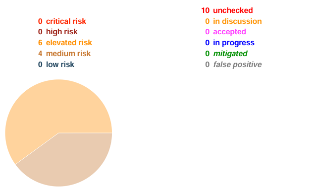

The accompanying risk summary gives a short description of the risk with estimated likelihood and impact 

### Risk Summary
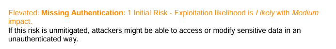
Note that this list of risks does not indicate which component the risk is associated with.

### Residual Risk Summary
The last chart in this section summarizes the unmitigated risks by severity and business unit that may own the mitigation decision.  Ideally we'd like to mitigate all the risks, and at the end of the day the business may have to decide which risks to mitigate and which require an exception.  When working in a DevSecOps model, the team that owns the application is likely able to assume ownership of all four business categories, streamlining the mitigation process. 

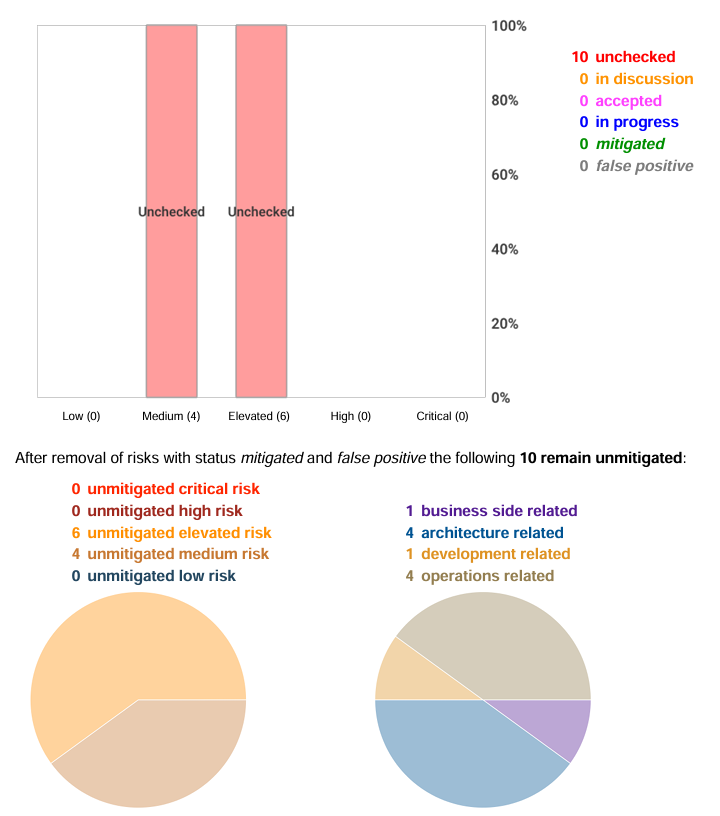

As with the initial risks, and following an inventory of assets, is the summary of remaining risks.  This list contains an identical summary of individual risks so that you don't have to scroll back up to understand what's left and what impact it might have.

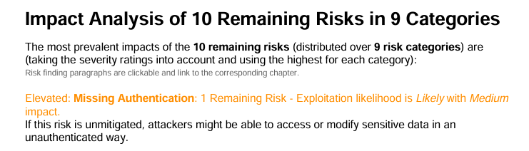

The next two sections are the STRIDE and Business classifications for the same risks summaries.  The STRIDE section groups the summaries by Spoofing, Tampering, Repudiation, Information Disclosure, and Elevation of Privilege risks.  The Business section groups them by the reviewing organization. 

This may seem redundant but, depending on who's reading the report, the reviewer may want to jump straight to any one of these sections from the table of contents from a context that's most relevant to their role.

## Relative Attacker Attractiveness
According to the summary, this section has calculated an attractiveness value and "the higher the RAA, the more interesting it is for an attacker to compromise the asset." Getting started, it may be beneficial to mitigate risks for assets with the highest RAA, but it's going to depend on a number of factors.  Because of that, you might be able to mitigate risks around the most attractive assets because their connections and proximity to other assets affects their scores as well. 

## Data Mapping
The data mapping section explains itself well and doesn't need much here.  Here you'll gain a high level overview of how data assets are distributed across technical assets.  Objects are color coded by data breach and risk probability while the lines help indicate if a technical asset processes (dashed) or stores (solid) the data.


## Assets Out of Scope
After data mapping comes assets out of scope  This is simply a list of technical assets that may be important to the model, but require no risk calculation.  In this model we have client web browsers.  Because these are public entities that we can't control we just need to understand the risk they pose to our model.

## Potential Model Failures
This section appears to surface a list of things that are nice to have, but depending on the scope and requirements of your project, may not be necessary.   This report suggests we might want build infrastructure and a vault to store secrets.

## Questions
The questions section is meant to be filled out as a team works through their model and they're unsure of the outcomes.  It is optional but shouldn't be overlooked.

## Risks By Category
At this point, the risks are going to have more details to help understand their context.  The categories may be dynamic based on the vulnerabilities discovered so we'll just highlight the common pattern here.


### Description
As you can see, we have a much more detailed analysis of the risk.  Each risk should have a technical description with a link to a technical article to better understand that risk.

### Impact
The impact section gives a summary of how the risk may affect your application.

### Risk Rating
This summary is a reminder of that the asset as well as the data it processes affect its rating.  More importantly, it list criteria to consider for false positives as well as plausible steps to mitigate the risk.  Each of these risk ratings should include links to help validate and mitigate the risks.

## Risk Findings
The risk findings section is a list of which assets are impacted, their likelihood of exploitation, and the potential impact.


## Risk by Technical Asset
This section gives the reviewer an asset by asset overview of risks.  It shows
* Details about the asset such as the description, CIA ratings, and communication links
* The list of risks that apply to the asset

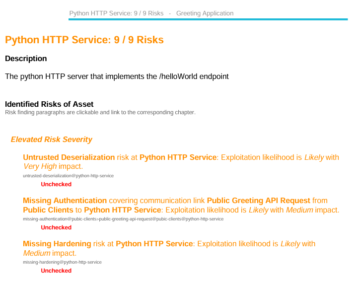
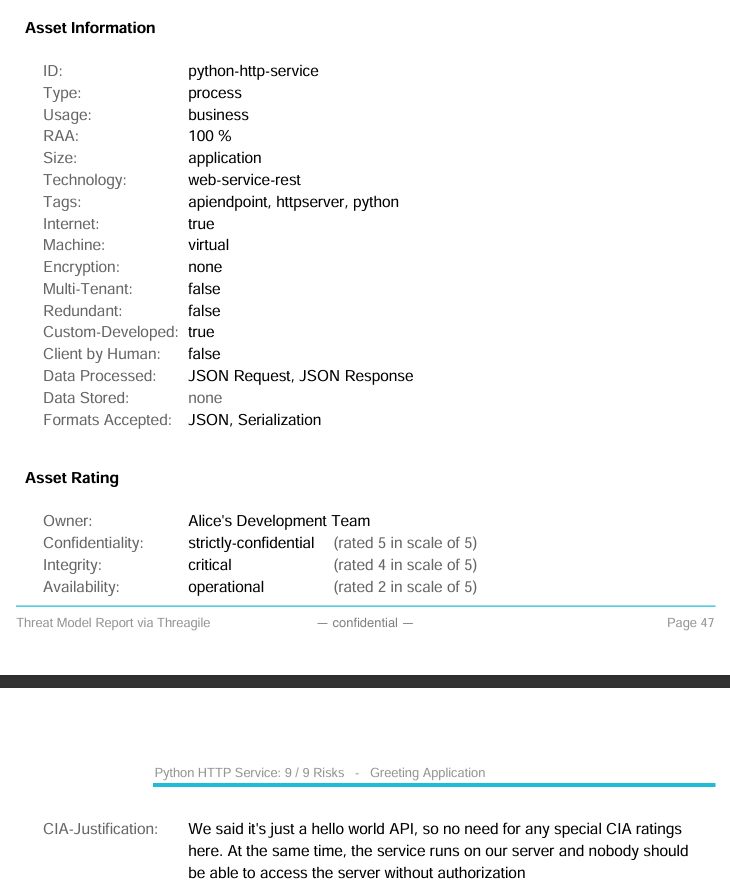

## Breach Probability
After technical assets we'll have a list of data assets.  This list shows
* Which Data Type is impacted
* A detailed summary of the Data Type
* Probability of a breach
* A list of the risks that affected this rating sorted by the likelihood that they contribute to the breach

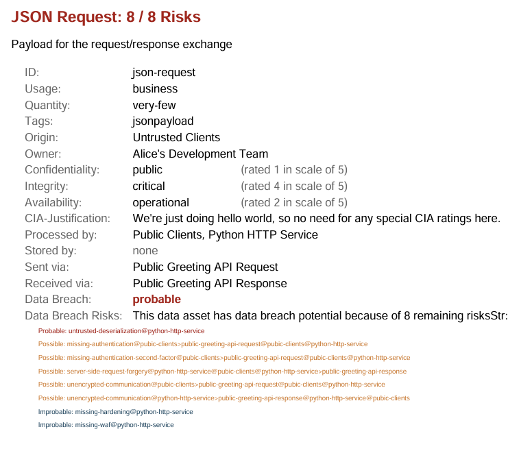

## Trust Boundaries
Much like we have with other assets, this list summarizes the trust boundaries so that the reviewer can gain an understanding without drilling into the model itself.
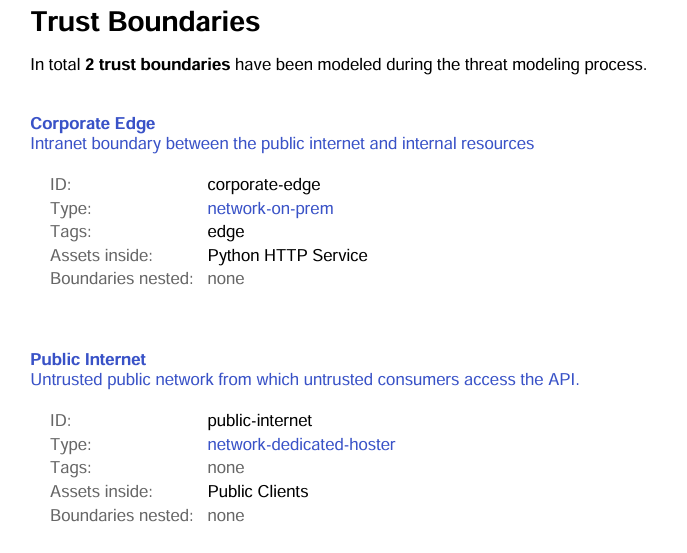

## Shared Runtimes
The penultimate section in the report is the list of Shared Runtimes.   Again, this would just be a summary of technical assets that share a common technical asset such as a kubernetes cluster shared runtime that process and stores multiple other technical assets.

## Model Checkpoint
The last section, other than a disclaimer, lists the version of threagile, build timestamp, report execution timestamp, the model filename, and a sha256 hash of the model file.

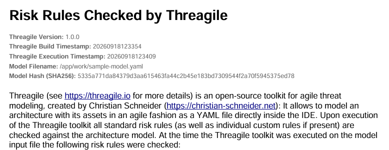

These give the team and reviewer a way to verify and validate the threat model.  It would also appear that a list of the rules that were used in this report should have been populated.  Perhaps this is only populated if custom rules are considered? TBD

# Other Report Artifacts
So far we've covered the business facing PDF report.  As mentioned in the syllabus, there are a number of default artifacts that are produced that can be used to enhance your workflow since many are easily consummable JSON format.

Of the most interest are the risks.* files. These files are the enumerated risks from your model, each entry with a unique identifier that can be used later during the mitigation steps. 

    {
        "category": "missing-authentication",
        "severity": "elevated",
        "exploitation_likelihood": "likely",
        "exploitation_impact": "medium",
        "title": "<b>Missing Authentication</b> covering communication link <b>Public Greeting API Request</b> from <b>Public Clients</b> to <b>Python HTTP Service</b>",
        "synthetic_id": "missing-authentication@public-clients>public-greeting-api-request@public-clients@python-http-service",
        "most_relevant_technical_asset": "python-http-service",
        "most_relevant_communication_link": "public-clients>public-greeting-api-request",
        "data_breach_probability": "possible",
        "data_breach_technical_assets": [
            "python-http-service"
        ]
    },


 This output comes in a standard json format, a GitLab SAST compatible file, sarif format, and lastly XLSX. If they're not going to be consumed, you can easily skip those outputs with the corresponding switches.

      --skip-risks-excel                   skip generating risks excel
      --skip-risks-gl-sast                 skip generating risks gitlab sast report
      --skip-risks-json                    skip generating risks json
      --skip-risks-sarif                   skip generating risks sarif

Other files available are:

**stats.json**: General statistics by risk category, etc.

**tags.xlsx**: A matrix of tags and the assets associated with each.

**technical-assets.json**: A JSON representation of the technical assets defined in the model.

**data-*-diagram.png**: Higher resolution version of the diagrams presented in the PDF report. 

# End of Lesson 1


In the next lesson we'll learn how to mitigate risks within the model.


[Next Step - Checking and Mitigating Risks](https://github.com/0x3f8/threat-model-demo/tree/Checking-and-Mitigating-Risks)