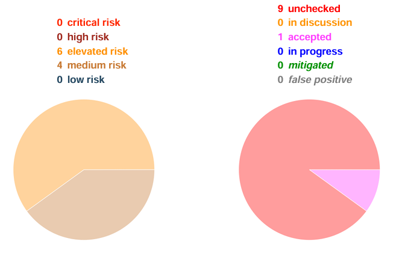
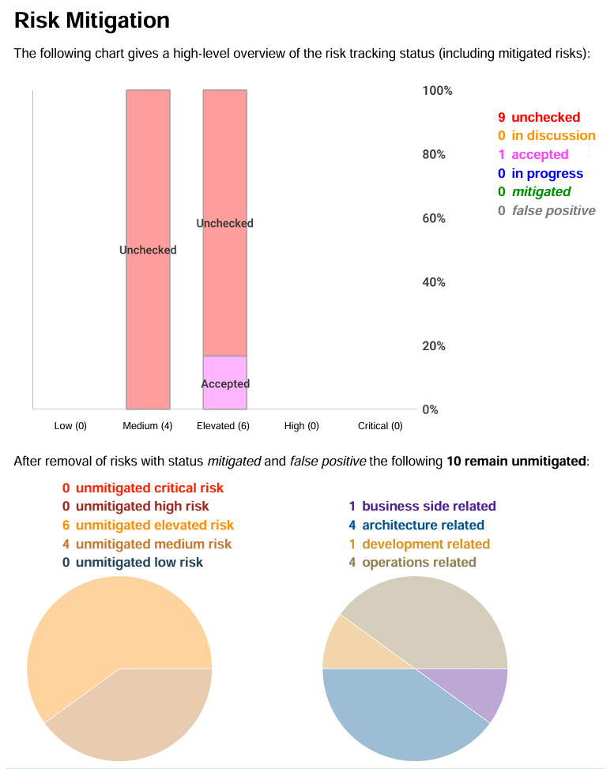
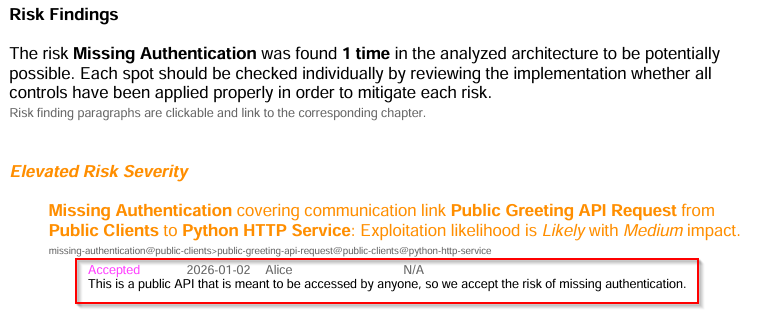
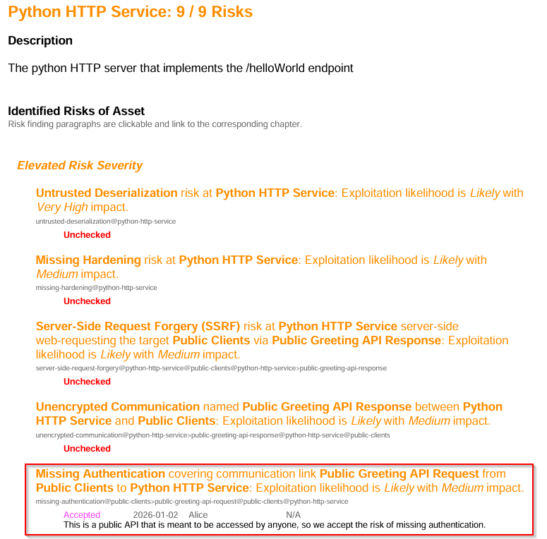
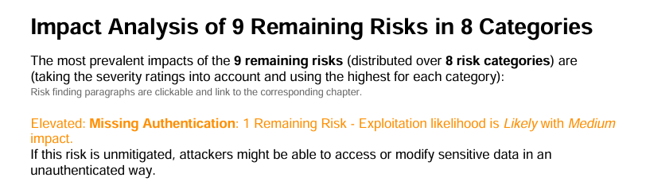
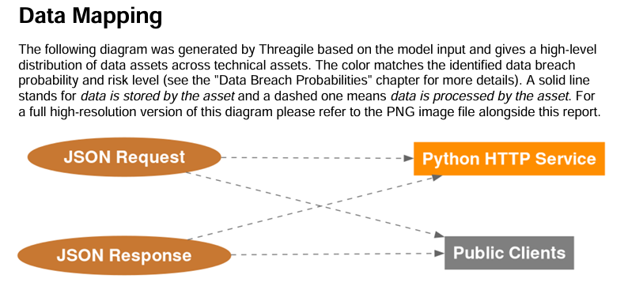
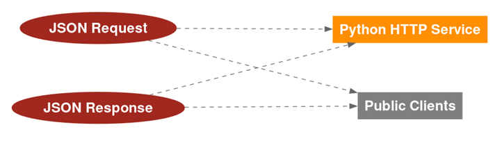

# Threat Model Demo Part 2 - Checking and Mitigating Risks

Now that we've created a threat model and generated a report we'll want to
* review the risks
* update the model
* regenerate the report to reflect updates

## Reviewing Risks
There are a number of ways to review your risk outputs, but the most programmatically oriented way may be to review the [JSON Risk Regstry](./report/risks.json).  For a more visual friendly format, there is also an [Excel Spreadsheet](./report/risks.xlsx).

Let's examine one of the easiest risks to mitigate for this threat model - Missing Authentication

``` jq '.[] | select(.category == "missing-authentication")' risks.json```

    {
        "category": "missing-authentication",
        "severity": "elevated",
        "exploitation_likelihood": "likely",
        "exploitation_impact": "medium",
        "title": "<b>Missing Authentication</b> covering communication link <b>Public Greeting API Request</b> from <b>Public Clients</b> to <b>Python HTTP Service</b>",
        "synthetic_id": "missing-authentication@public-clients>public-greeting-api-request@public-clients@python-http-service",
        "most_relevant_technical_asset": "python-http-service",
        "most_relevant_communication_link": "public-clients>public-greeting-api-request",
        "data_breach_probability": "possible",
        "data_breach_technical_assets": [
        "python-http-service"
        ]
    }

You'll want to take note of the ```synthetic_id``` for this risk.  This is a unique id generated for each risk and should be specific to each asset.   You wouldn't want a blanket "Missing Authentication" risk because your endpoints could be a mix of those to should and shouldn't use authentication.  There is a way to wildcard a mitigation to several risks at once, but I wouldn't recommend it.

## Risk Acceptance and Mitigation

If you recall the requirements you'll remember that authentication wasn't listed.  The business intent was to simply have a Hello World type API.  To update our threat model we're going to open our model and add a new section.

All of our updates will go into the ```risk_tracking:``` block of the yaml.  Because it was an optional element, and because we need the unique ```synthetic_id``` of the risk to even action those items, we couldn't have even included this in the initial model.

We'll title each element by it's synthetic id. 

    risk_tracking:
        missing-authentication@public-clients>public-greeting-api-request@public-clients@python-http-service:
            description: The public clients can access the API without any authentication, which is a risk.
            status: accepted
            justification: >
            This is a public API that is meant to be accessed by anyone, so we accept the risk of missing authentication.
            ticket: N/A
            date: 2026-01-02
            checked_by: Alice

If we now regenerate our report, we'll notice a number of changes.
In order we first have the summary which now shows one risk has been accepted.



The next update is to the larger Risk Track details which, honestly, just presents the risks with a couple of more specific charts and graphs.



Rather than nitpick every single change in the report for this change, let's look at the most signficant changes.  Under the Risk Findings for Missing Authentication, and under the Python HTTP Service, we will now have these updated findings.

First, within the defined risk, is the updated finding



Next, we'll see a similar update in the Python HTTP Service



**NOTE:**  While this covers what you would expect to see, there is one detail you might be wondering about.

In the Risk Mitigation section early in the report, it details the status of the risks and that we've accept 1 of these risks.   However, in the following section for Impact Analysis, 10 of 10 risks are still listed as remaining. Why?  This is because we've accepted the risk instead of mitigating the risk or otherwise negating it in some other way.  Should we make a change to this endpoint and the business intent is that authentication is required, we have no mitigation and the risk still remains.  To prove that with a different risk, lets actually mitigate the Second Factor Authentication risk.  If authentication isn't required, or even possible in this case, then this risk is mitigated.

    missing-authentication-second-factor@public-clients>public-greeting-api-request@public-clients@python-http-service:
        description: There is no authentication method, so there is no second factor authentication required.
        status: mitigated
        justification: >
        We don't allow authentication at all, so MFA is pointless.
        ticket: N/A
        date: 2026-01-02
        checked_by: Alice

With the new mitigation added to the model we can re-run the report and confirm that, instead of 10 remaining risks, we now only have 9.



Lastly, lets mitigate a risk that should have a significant impact within the report.   One of the highest rated risks is listed as Untrusted Deserialization.  Within the Python HTTP Service we define the following

    data_formats_accepted: # sequence of formats like: json, xml, serialization, file, csv
      - json
      - serialization

I wanted to show the risks of untrusted input in the initial threat model and have a way to show how it impacts a report.  So, I put serialization as an accepted format.  This is because, at least with Python, there are several ways to consume this API request.

The safer way would be with ```import json``` with ```json.loads``` to read the request.  However, there is a very unsafe way with ```jsonpickle``` and ```jsonpickle.decode``` which will deserialize a json object and potentially allow remote code execution.

The more obvious way to fix this risk is to use the safer method and remove serialization as an accepted format. However, to show how mitigating this affects the report, lets deal with the latent risk instead.

    untrusted-deserialization@python-http-service:
        description: The API endpoint could deserialize the JSON payload sent by the public clients, which is untrusted input.
        status: mitigated
        justification: >
        The API endpoint will use a safe deserialization library that prevents code execution and other attacks.
        ticket: N/A
        date: 2026-01-02
        checked_by: Alice

Now if we run our report again and look at the Data Mapping Chart we'll see that our report has changed in a positive way.



Previously, the objects were red, indicating more risk.



Hopefully this demonstrates the usefulness of threat modeling with valid examples of risks, accepted risks, and mitigated risks.

[Using Optional Business and DevOps Fields](link_to_next_branch)